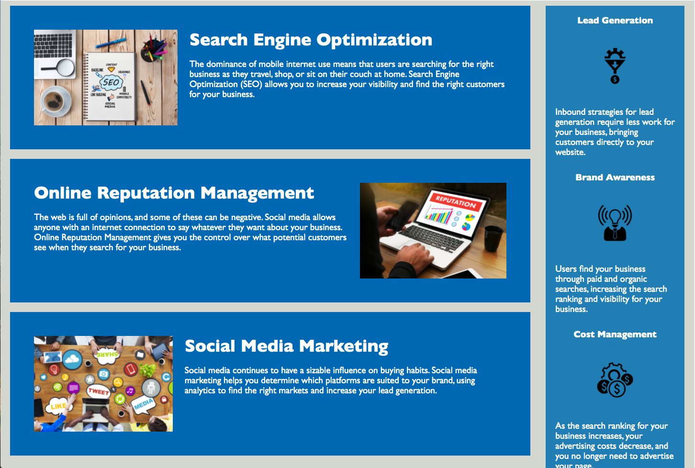

# Refactoring Project

## Description 

I was tasked with refactoring the Horiseon webpage, with special consideration for increasing accesibility and reducing redundancy. I wanted to give descriptive, concise alt attributes for all images and icons, as well as refine the HTML to for SEO. Additionally, the CSS was able to made less cumbersome. Ultimately, all code is more comprehensible, and now meets accessibility standards.


## Usage 

A fairly basic and intuitive layout, the site is quite simple to navigate. Included are some screen captures to demonstrate the layout of the site.

```md

```md


## Built With

* [HTML](https://developer.mozilla.org/en-US/docs/Web/HTML)
* [CSS](https://developer.mozilla.org/en-US/docs/Web/CSS)

## Deployed Link

* [See Live Site](https://scottybuoy.github.io/refactoring-demo/)


## Authors

* **Scott Everett** 

- [Link to Github](https://github.com/scottybuoy)
```


## Credits

I relied heavily on tutorials and resources from the following sources:

* [W3 Schools](https://www.w3schools.com/)
* [Mozilla Developer Network](https://developer.mozilla.org/en-US/)


